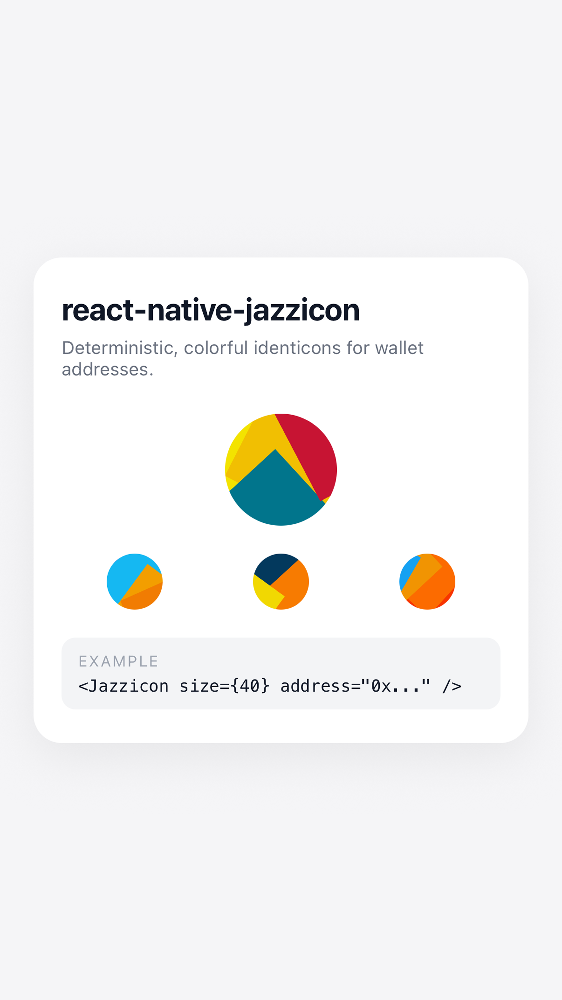

# react-native-jazzicon

React Native library for generating deterministic Jazzicons (Ethereum-style identicons) from addresses.



## Installation

```sh
npm i @arturhoncharuk/react-native-jazzicon
```

Then run one of the following to link native dependencies:

- **Bare React Native (iOS):** `cd ios && pod install && cd ..`
- **Expo:** `npx expo prebuild`

## Usage

```tsx
import { Jazzicon } from '@arturhoncharuk/react-native-jazzicon';

const ADDRESSES = [
  '0x1234567890123456789012345678901234567890',
  '0x742d35Cc6634C0532925a3b844Bc9e7595f2EE31',
];

function Example() {
  return (
    <>
      <Jazzicon size={80} address={ADDRESSES[0]} />
      <Jazzicon size={40} address={ADDRESSES[1]} />
    </>
  );
}
```

## Props

- **`size`**: number – diameter of the identicon in pixels. Defaults to `16`.
- **`address`**: string – wallet address used to generate the identicon. If provided, it is converted to a deterministic seed.
- **`seed`**: number (optional) – numeric seed used when `address` is not passed.
- **`containerStyle`**: `ViewStyle` (optional) – additional styles for the outer container.

## Contributing

- [Development workflow](CONTRIBUTING.md#development-workflow)
- [Sending a pull request](CONTRIBUTING.md#sending-a-pull-request)
- [Code of conduct](CODE_OF_CONDUCT.md)

## License

MIT

---

Made with [create-react-native-library](https://github.com/callstack/react-native-builder-bob)
